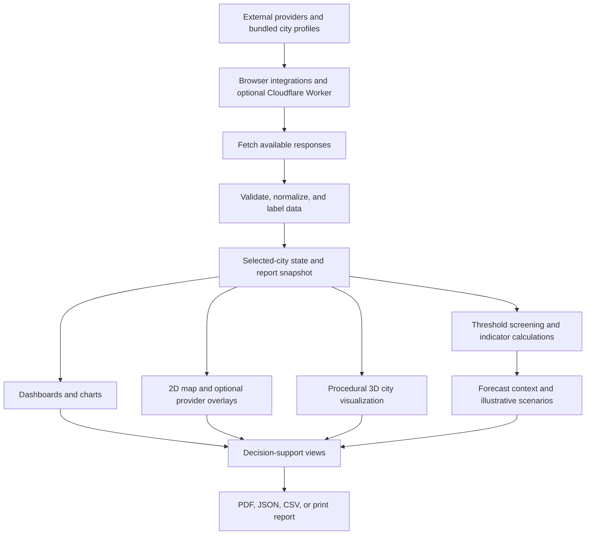
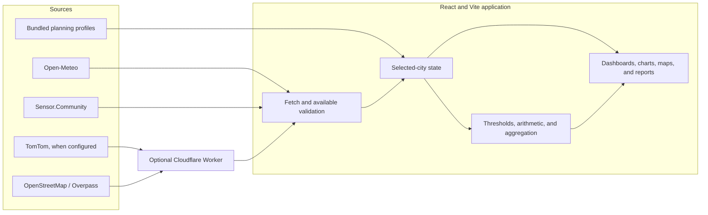
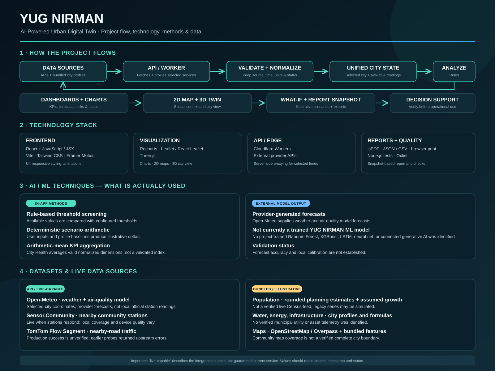

# YUG NIRMAN

## AI-Powered Urban Digital Twin & Urban Intelligence Platform

YUG NIRMAN is an interactive city-intelligence and urban-planning platform. It brings selected city profiles, public data integrations, analytical indicators, maps, forecasts, scenario tools, and reports into one browser-based experience.

Its guiding workflow is:

> **Observe → Detect → Understand → Predict → Simulate → Optimize → Decide → Measure → Report**

The goal is to help people explore how mobility, environment, weather, population, water, energy, and infrastructure may interact. It is a planning and demonstration tool—not an operational control system, an official city record, or a substitute for validated municipal analysis. Not every displayed metric is live, independently verified, or based on the same kind of evidence.

## At a glance

- **Frontend:** React, JavaScript/JSX, Vite
- **Maps and visualization:** Leaflet, React Leaflet, Three.js, Recharts
- **Optional edge service:** Cloudflare Worker for selected traffic and OpenStreetMap-related requests
- **External services in the code:** Open-Meteo, Sensor.Community, TomTom, OpenStreetMap and Overpass
- **Analysis:** threshold-based screening, deterministic scenario arithmetic, normalized indicator aggregation, and provider-generated forecasts where available
- **Reports:** city-intelligence snapshot, PDF, JSON, CSV, and browser print
- **Project-trained ML model:** none identified in the current source
- **Public demo:** account and administrative access are disabled

## Project flow



The app combines data with different provenance. An API integration being present does **not** mean a live response is currently available. Where possible, the interface and report show source, time, unit, location, and a status or limitation. Missing or failed data should remain unavailable rather than being presented as a measured value.

## Core workflow

1. **Data sources:** public services and bundled city profiles provide whichever values are available.
2. **API and edge layer:** the frontend calls public services directly where configured; the optional Worker proxies selected TomTom and OpenStreetMap/Overpass requests. The Worker is not a general database or a complete integration for every metric.
3. **Validation and normalization:** response fields and units are checked where implemented, and data is associated with its source and retrieval or observation time.
4. **Selected-city state:** the React city context supplies selected-city information and available feed state to the pages. Coverage is not uniform across metrics or cities.
5. **Analysis:** code applies documented screening thresholds, deterministic calculations, or simple aggregation where implemented.
6. **Visualization:** dashboards, charts, maps, and the 3D scene display a mix of feed data, model output, and illustrative profiles.
7. **Scenario and reporting:** scenario calculations can compare available baseline and changed values; report exports use a generated snapshot and retain data limitations where available.
8. **Decision support:** outputs are prompts for exploration and verification, not approved actions or guaranteed impacts.

### Architecture



The deployed frontend workflow in this repository targets **GitHub Pages**. The data Worker is deployed separately to **Cloudflare Workers**. Cloudflare Pages and a database-backed service are not configured as the current deployment path.

## Main features and current boundaries

| Feature | What it provides | Data and method | Current boundary |
|---|---|---|---|
| City overview | Selected-city indicators and summaries | Mix of available feeds and bundled profiles | A dashboard value is not necessarily a live measurement |
| KPI dashboard and trend analysis | Selected indicators, charts, and comparisons | Recharts over available feed, profile, or forecast series | A plotted series may be illustrative or model output, not historical observation |
| Digital city twin | Connected urban-system views | Selected-city state and page-level analysis | Not a calibrated operational twin |
| 2D interactive map | Geographic context and returned map features | Leaflet, React Leaflet, OpenStreetMap; optional feed layers | Coverage depends on source response and location |
| 3D city visualization | Navigable city-like scene | Three.js and procedurally generated visual elements | Buildings, roads, and overlays are illustrative, not surveyed assets |
| City health | Composite planning indicator | Equal arithmetic mean of available normalized Mobility, Environment, Energy, and Water dimensions | Not a standardized or validated municipal score |
| City diagnosis / problems | Indicators that cross configured screening thresholds | Available live/model/profile inputs and explicit evidence labels | Thresholds are illustrative; they do not prove an incident or its cause |
| Traffic | Traffic context and optional road-flow data | TomTom nearest-road flow when the Worker and provider access work; bundled profile and separate live simulation | A nearest-road point is not a citywide average; simulation is not live traffic |
| Air quality | AQI/pollutant context and short-range outlook | Open-Meteo model output; nearby Sensor.Community records when returned | A model is not a municipal monitor; station coverage/device quality vary |
| Weather | Current/provider forecast context | Open-Meteo selected-coordinate response | Provider model output; availability depends on the service and location |
| Climate and risk | Selected climate indicators and screening context | Available weather fields, thresholds, and profile values | Not a locally calibrated multi-hazard or official warning service |
| Early-warning context | Selected conditions that may need attention | Available provider forecasts and rule-based thresholds | Not an emergency notification system or official warning |
| Population | Population profile and selectable-year projections | Bundled July 2026 planning estimate table and assumed 2% annual projection | Estimates have incomplete boundary/source provenance; projections are not official |
| Water and energy | Planning indicators and charts | Bundled profiles and formulas | No verified utility telemetry is connected |
| Infrastructure | City-planning context and visual layers | Bundled/profile values and illustrative scene content | No verified municipal asset inventory or condition feed |
| Future predictions | Outlooks and forecast context | Provider weather/AQ forecasts and deterministic/profile-based projections | Accuracy is not validated; long-range outputs are not trained model forecasts |
| What-if simulation | Compare selected inputs and calculated outcomes | Deterministic arithmetic against a bundled city profile | Illustrative; only supported outputs are calculated, unavailable values remain unmodeled |
| Scenario comparison | Compare displayed scenario values | Supplied or bundled scenario inputs and delta calculations | Not calibrated; no measured impact or confidence should be inferred |
| Before/after analysis | Show input changes and derived differences | `after - before`; percentage change where the baseline permits | Zero baselines do not produce a percentage; scenario evidence may be illustrative |
| Root-cause intelligence | Possible contributing factors and evidence prompts | Threshold screening and available indicators | Correlation is not causation; causes are not confirmed |
| Anomaly detection | No dedicated anomaly-detection model or validated detector identified | Not implemented as a validated anomaly-detection capability | Do not interpret threshold screening as anomaly detection |
| City benchmarking | No verified, comparable external city benchmark dataset identified | Not available as an evidence-backed benchmarking feature | Cross-city comparisons may mix different profile assumptions |
| City resilience | Resilience-oriented indicators and planning context | Available city and climate indicators | Not an official readiness rating or emergency certification |
| Sustainability / SDG | Resource and sustainability-oriented views | Available profile values and calculations | Indicators may be illustrative; no independent SDG certification |
| AI advisor / recommendations | Template-based recommendation and interpretation UI | Local templates and available context | No connected generative-AI service or validated recommendation model identified |
| Reports and export | Snapshot-based city intelligence report | Available report inputs and provenance/limitation fields | Export quality inherits source and data-coverage limitations |
| Data center | Feed/source and status context | Provider and Worker state where available | Worker configuration does not prove upstream provider success |
| Admin and accounts | Admin/account source modules remain in the codebase | No secure server-side identity service is configured | Disabled and unreachable in the public demo; do not treat client code as authorization |
| Export center | Download report and prediction artifacts | jsPDF, JSON, CSV, and browser print where supported | Public demo report archiving is unavailable; downloads stay with the visitor |

## Technology stack

| Technology | Category | Where it is used | Purpose |
|---|---|---|---|
| React | Frontend | Pages, reusable components, and application state | Builds the interactive single-page interface |
| JavaScript / JSX | Application language | UI components, state, calculations, and integrations | Implements client behavior and rendering |
| Vite | Build tooling | Development server and production bundle | Runs local development and builds the frontend |
| Tailwind CSS | Styling | Responsive pages and dashboard components | Utility-based visual styling |
| Framer Motion | UI animation | Navigation, transitions, and interactive components | Adds motion and transition effects |
| Recharts | Data visualization | KPI and trend charts | Renders chart components from supplied series |
| Leaflet | Mapping | Interactive 2D maps | Displays geographic maps and layers |
| React Leaflet | React mapping | Map components in React pages | Connects Leaflet maps and layers to React |
| Three.js | 3D graphics | Lazy-loaded city scene | Renders a procedural, illustrative 3D scene |
| Cloudflare Workers | Edge/API | Optional `api-worker/` service | Proxies selected requests, applies request validation/rate limits, and keeps provider secrets server-side |
| Open-Meteo | External data service | Weather and air-quality requests | Supplies coordinate-based model forecasts where available |
| Sensor.Community | External data service | Nearby community sensor lookup | Supplies returned community-operated station data; coverage varies |
| TomTom | External data service | Optional flow-segment and traffic-tile requests via Worker | Supplies road traffic information when a valid Worker secret and provider access are available |
| OpenStreetMap | Geographic data | Basemaps and geographic features | Provides community-maintained map data |
| Overpass API | Geographic query service | Selected Worker map-feature requests | Queries OpenStreetMap feature data |
| jsPDF | Reporting | PDF report exports | Generates downloadable PDF reports in the browser |
| JSON | Data format | API payloads and report export | Represents structured data |
| CSV | Data format | Report and forecast exports | Exports tabular values |
| Browser Print | Browser capability | Report page | Opens the browser print dialog for printable output |
| Node.js | Development tooling | Package scripts and tests | Runs the JavaScript toolchain and test runner |
| Oxlint | Code quality | `npm run lint` | Reports lint and static-quality findings |

### Technology-to-feature mapping

| Feature | Technology | Technique | Result |
|---|---|---|---|
| 3D city view | React + Three.js | Procedural rendering | Interactive illustrative scene |
| 2D city map | React + Leaflet + React Leaflet | Geographic layers | Spatial context from available map data |
| Analytics | React + Recharts | Chart rendering | KPI, trend, and comparison visualizations |
| Weather/AQ | Open-Meteo + frontend integration | Provider model request | Coordinate-based weather and AQ information when returned |
| Community air observations | Sensor.Community + frontend integration | Nearby station query | Station observations when source coverage exists |
| Traffic | TomTom + Cloudflare Worker | Server-side provider request | Flow/tile data when configured and accepted by provider |
| OSM map features | Overpass/OpenStreetMap + Worker | Bounded feature query and fallback | Returned geographic features with source-dependent coverage |
| City diagnosis | JavaScript analysis helpers | Threshold screening | Evidence-labeled indicators that merit checking |
| City health | JavaScript analysis helper | Mean of available normalized dimensions | Demonstration composite score |
| What-if | React + scenario utilities | Deterministic arithmetic | Illustrative changed values for supported metrics |
| City report | React + jsPDF / JSON / CSV / print | Snapshot-based export | Downloadable or printable report |

## Data sources and status

| Source | Data | Status in this project | Purpose | Limitation |
|---|---|---|---|---|
| Open-Meteo | Weather and air-quality model fields | Provider output when a request succeeds; otherwise unavailable | Selected-coordinate weather/AQ context | Not an official local monitor; model and field availability vary |
| Sensor.Community | Nearby community station observations | Live-capable when stations respond | Particulate readings and station locations | Coverage, device quality, placement, and freshness vary |
| TomTom | Flow segment and traffic tiles | Optional/live-capable when Worker secret and provider access work | Road-specific traffic context | Do not assume it is working; a nearest-road point is not citywide traffic |
| OpenStreetMap | Basemap and mapped geographic data | Retrieved map data where available | Geographic context | Community coverage varies and is not a verified municipal asset inventory |
| Overpass API | OpenStreetMap feature query responses | Queried through the Worker where available | Roads and mapped feature lookups | Public service availability/rate limits and feature completeness vary |
| Bundled city profiles | Population, traffic, water, energy, environmental and other planning indicators | Static, estimated, simulated, or illustrative depending on field | Offline planning context and scenario baseline | Not automatically live municipal telemetry; source and boundary documentation may be incomplete |
| Local browser state | Selected city, display preferences, and some local artifacts | Browser-local | Preserve user-facing preferences and generated outputs | Not shared between devices; local storage is not secure identity or authorization |

### Status vocabulary

The application uses status terminology in several parts of the UI. These definitions describe the meaning intended in this README; they do not imply every screen uses every label consistently.

| Status | Meaning |
|---|---|
| **LIVE** | A value was returned by a current connected source. Show its source and timestamp; API availability alone is not enough. |
| **HISTORICAL** | A dated observation or archive record from an identified source. The project does not have a verified citywide historical archive for every metric. |
| **PREDICTED** | A future value from a provider forecast or an explicitly described projection. Identify which one; do not imply a project-trained ML model. |
| **SIMULATED** | A locally calculated or generated scenario/simulation output, not an observed city measurement. |
| **ESTIMATED** | A derived or estimated value with a stated basis and limitations. |
| **ILLUSTRATIVE** | Example, bundled planning profile, or visual layer that is not validated as a real city observation. |
| **UNAVAILABLE** | No valid value was returned or no suitable source/model exists. Keep it unavailable rather than inventing a value. |

For important metrics, preserve **source, timestamp, unit, status, and city/location** where those details are available. A request timestamp is not necessarily the provider's observation time.

## AI and analytical methods actually used

YUG NIRMAN currently relies primarily on deterministic analytical methods and external provider-generated forecasts rather than a project-trained machine-learning model.

1. **Rule-based threshold screening:** available indicators are compared with configured thresholds to flag values for review. Thresholds are demonstrative and do not confirm an event, official risk level, or cause.
2. **Deterministic scenario arithmetic:** selected user inputs and bundled baselines produce calculated outcomes for supported metrics. Results are illustrative, not calibrated impact forecasts.
3. **Arithmetic-mean KPI aggregation:** the City Health demonstration score averages available normalized Mobility, Environment, Energy, and Water dimensions. Missing dimensions are excluded. This is not a validated municipal index.
4. **External provider-generated forecasts:** Open-Meteo may return short-range model output for weather and air quality. These are provider forecasts, not a model trained by this project.
5. **Templates and heuristics:** recommendation text and some planning interpretations use local templates or rules; no connected generative AI service was identified.

The current source does not establish use of a trained Random Forest, XGBoost, LSTM, CNN, Transformer, neural network, deep-learning, or generative-AI model. Forecast accuracy and recommendation quality are **not validated**. Confidence is unavailable unless an individual feature explicitly supplies a justified confidence measure.

## Data pipeline and unified city state

```text
External services and bundled profiles
                  ↓
       Browser / optional Worker
                  ↓
       Fetch and validate response
                  ↓
 Normalize fields where implemented
                  ↓
 Source + time + unit + status + location
                  ↓
 Selected-city state and report snapshot
                  ↓
 Analysis → maps/charts → forecast context/scenario
                  ↓
          Decision support and report
```

Normalization helps screens compare compatible fields and display consistent units and provenance. The current application is a growing demo rather than a fully governed city-data platform: data does not have uniform coverage, and the presence of selected-city state does not guarantee every feature reads one perfectly reconciled dataset.

Where available, city state and report context may include:

- City name and reference coordinates
- Population estimate and projection assumptions
- Weather and air-quality model output
- Traffic provider result or illustrative traffic profile
- Water, energy, and infrastructure profile values
- Climate indicators and geographic features
- Forecast or scenario inputs and outputs
- Retrieval/observation timestamps, sources, units, and data status

Dashboards, maps, and reports should be interpreted against their displayed provenance. Do not combine differently defined values (for example, a nearest-road traffic delay and a bundled citywide traffic index) as if they were the same measurement.

## Traffic intelligence

Traffic features combine optional TomTom road-flow information, mapped road context, and illustrative profile/simulation content.

- The TomTom flow integration requests a road segment near the selected city's reference coordinates. It is a point/segment reading, **not** a citywide traffic average.
- Traffic tiles are optional and depend on Worker configuration, TomTom access, network conditions, and the requested area.
- Road geometry and mapped features come from available OpenStreetMap responses; map completeness is not guaranteed.
- The rolling `LIVE SIMULATION` series is generated locally from bundled illustrative profiles. “Live” in this label refers to the refreshing simulation, not live traffic measurements.
- The project does not establish a verified historical traffic archive or calibrated citywide traffic forecast.
- Scenario outputs are arithmetic demonstrations and do not prove an intervention's real-world impact.

If TomTom fails, the interface should show the error/unavailable state and keep sample profile information separate from live readings.

## Air quality intelligence

The app can display Open-Meteo coordinate-based AQI/pollutant output and nearby Sensor.Community station records when returned. Keep these evidence types distinct:

- **Provider model output** is not the same as a local station measurement.
- **Community station data** may vary in coverage, calibration, placement, and freshness.
- An AQI trend from a model forecast is not verified historical sensor data.
- Verify important public-health decisions with the relevant official monitoring authority.
- Show source, location, timestamp, and units where available; if the request fails, report the value as unavailable.

## Climate and risk

Climate-related pages surface selected weather fields, risk indicators, and threshold-based planning context where implemented. Inputs can include forecast precipitation probability, soil moisture, temperature, pressure, wind, air quality, and profile-derived city indicators.

The application does not establish locally calibrated flood, drought, heat, storm, infrastructure-exposure, or population-vulnerability models. A displayed indicator or risk screen is not an official warning. A possible contributing factor is not a confirmed cause. Validate urgent risk information with local authorities and specialist datasets.

## Root-cause, prediction, and scenario interpretation

### Evidence before explanation

The intended interpretation chain is:

```text
Problem indicator → Evidence → Possible contributing factor → Suggested action → Verification
```

Threshold screening can surface an indicator, but it cannot establish causation from correlation. Where evidence is incomplete, interpret explanations as **possible contributing factors**, not confirmed root causes.

### Prediction types

| Type | Meaning here |
|---|---|
| Provider forecast | A short-range forecast returned by an external provider such as Open-Meteo |
| Deterministic projection | A formula applied to a stated baseline and assumptions, such as the population projection |
| Scenario result | Calculated output from selected interventions and illustrative baseline values |
| Historical observation | A dated observation from an identified source; a verified citywide archive is not generally connected |

The population profile uses a bundled estimate with a July 1, 2026 reference date and an assumed 2% annual rate for selected future horizons. This assumption is not an official forecast. Accuracy is not validated.

### What-if and before/after

```text
Baseline → User intervention → Scenario calculation → After state → Difference and trade-offs
```

Absolute change is calculated as:

```text
absoluteChange = after - before
```

Percentage change is calculated only when the baseline is non-zero:

```text
percentageChange = ((after - before) / before) × 100
```

Only implemented, supported metrics should show an after-value. Missing inputs must not be filled with invented values. Improvement/deterioration depends on metric direction and should be interpreted alongside units and trade-offs; calculations alone do not demonstrate real-world impact.

## City health, resilience, and sustainability

- **City Health:** a transparent demonstration score based on the arithmetic mean of available normalized Mobility, Environment, Energy, and Water dimensions. Missing dimensions are excluded. It is not a standardized or scientifically validated city-health score.
- **Resilience:** available hazard, resource, and infrastructure context may support exploration, but the app does not certify emergency readiness or provide an official resilience rating.
- **Sustainability / SDG-oriented views:** these are planning indicators and profile-derived calculations where implemented. They do not constitute SDG reporting, an external audit, or certification.
- Scores and indicators should retain the input provenance and should not imply greater precision than the source data supports.

## Decision support and recommendations

Recommendation and advisor screens use local templates and available indicators. They are not backed by a connected generative AI model. Treat a recommendation as a review prompt:

1. Check the evidence and source.
2. Separate measured or provider-returned values from profiles and estimates.
3. Consider the proposed explanation as a hypothesis, not proven causation.
4. Verify the suggested action with authoritative data and qualified decision makers.
5. Do not interpret directional comparisons as measured or guaranteed impacts.

## Reports and exports

The City Intelligence Report builds a report snapshot from the selected city and available report inputs. It supports PDF generation through jsPDF, structured JSON/CSV export, and browser printing. The report includes available city status, trends, risks, scenario information, recommendations, and data gaps where supported by the snapshot.

Reports inherit the limitations of their inputs. They should not generate missing measurements or present illustrative data as live. Where present, report metrics should retain source, timestamp, unit, status, and location.

PDF report archiving in the public demo is unavailable because user accounts/admin access are disabled. A PDF can still be downloaded; that does not mean it has been uploaded to a server or stored in an administrator account.

## Public demo, security, and limitations

This repository is prepared as a **public read-only demo**:

- The dashboard and city-planning pages are accessible without an account.
- Login and registration routes redirect to the demo; administrative and messaging routes are disabled or redirected.
- The UI may allow local what-if calculations and browser preferences; “read-only” means no authenticated administrative/server-side city control.
- Do not use browser `localStorage` as authorization or identity.
- No secure server-side authentication or database-backed role enforcement is configured in this repository.
- Do not put provider secrets in frontend source, `.env.local`, `VITE_*` variables, or committed files.
- Store private API keys as Cloudflare Worker secrets. CORS allowlists and rate limits are not substitutes for authentication.
- Public API availability, provider credentials, deployed Worker behavior, and current GitHub Pages status must be verified in their respective services.

Further limitations:

- Water, energy, and infrastructure indicators are generally bundled profile values or formulas, not verified utility telemetry or asset inventories.
- Population values are static estimates with incomplete source/boundary provenance; future values use an explicit assumed rate.
- Forecast accuracy and long-range city projections are not backtested.
- No connected historical archive was identified for many chart series.
- Additional city values may reuse a reference-city profile; check each displayed source note.
- The 3D scene and some map overlays are illustrative, not surveyed or live asset layers.
- A successful Worker `/api/status` response that reports a configured secret does not prove the upstream provider accepts that key.
- This README documents the codebase, not a guarantee that every feature or external endpoint is operational at runtime.

## Repository layout

```text
.
├── .github/
│   └── workflows/
│       └── deploy.yml             # GitHub Pages build/deploy workflow
└── ai-future-city-simulator/
    ├── api-worker/                # Optional Cloudflare Worker and tests
    ├── public/                    # Public assets and technology/data-flow infographic
    ├── src/
    │   ├── components/            # Shared UI and dashboard components
    │   ├── context/               # City and public-demo application state
    │   ├── data/                  # Bundled profiles and explanatory data
    │   ├── pages/                 # Application routes
    │   └── utils/                 # Analysis, reporting, and scenario helpers
    ├── package.json
    └── vite.config.js
```

## Run locally

Requirements: Node.js compatible with the Vite version in the package manifest, npm, and a modern browser.

```sh
cd ai-future-city-simulator
npm ci
npm run dev
```

Vite prints the local URL after startup. The application can be explored without sign-in. Some public feeds or map services may be unavailable because of network, provider, Worker, CORS, rate-limit, or credential configuration.

Build and preview the production bundle:

```sh
npm run build
npm run preview
```

Run the linter:

```sh
npm run lint
```

Focused Node.js test scripts, run from `ai-future-city-simulator/`:

```sh
npm run test:climate-risk
npm run test:diagnosis
npm run test:city-health
npm run test:report-snapshot
npm run test:feature-why
npm run test:transformation
npm run test:population
npm run test:worker
```

## Optional Cloudflare Worker configuration

The frontend has a default Worker URL. To use another Worker, set `VITE_DATA_API_URL` to its public base URL in a local `.env.local` file or in the GitHub Actions repository variable. This URL is public configuration, **not a secret**.

Deploy the Worker from its directory with Wrangler:

```sh
cd ai-future-city-simulator/api-worker
npx wrangler deploy
```

Configure its allowed browser origins in `api-worker/wrangler.toml` to match the exact deployed site origin, plus any local development origins required. Origins do not include URL paths. To configure TomTom access, add the key only as a Worker secret:

```sh
npx wrangler secret put TOMTOM_API_KEY
```

For local Worker development, use an ignored `api-worker/.dev.vars` file. Never commit the key or expose it through a frontend environment variable. See the application [deployment and data notes](ai-future-city-simulator/README.md) and Worker config for repository-specific details.

## Deployment

The repository's `.github/workflows/deploy.yml` builds the nested Vite app and deploys the generated site to **GitHub Pages** when changes are pushed to `main` or the workflow is manually started. It also configures the repository-specific Vite base path and a fallback for client-side routes.

To enable Pages, open **Repository Settings → Pages** and select **GitHub Actions** as the build/deployment source. The app build uses `VITE_DATA_API_URL` from repository variables when supplied. The Cloudflare Worker is a separate deployment and must be configured independently.

```text
GitHub repository
       ↓ push to main
GitHub Actions
       ↓ npm build
GitHub Pages frontend
       ↓ selected API requests
Cloudflare Worker (optional)
       ↓
External providers
```

GitHub Pages status and live feed availability are independent. Confirm the workflow run and deployed site before sharing a production URL. No database-backed deployment is configured.

## Technology and data-flow infographic



## Related project documentation

- [Application setup, traffic/map behavior, and live-data configuration](ai-future-city-simulator/README.md)
- [System audit, data integrity, and known limitations](ai-future-city-simulator/FINAL_SYSTEM_AUDIT.md)
- [Data-flow infographic source](ai-future-city-simulator/public/yug-nirman-technology-data-flow.svg)

## Responsible use

Use YUG NIRMAN to explore city data and illustrative planning scenarios. Verify all important values against authoritative sources, check the timestamp and status, and seek qualified local review before making policy, safety, infrastructure, or resource-allocation decisions.
